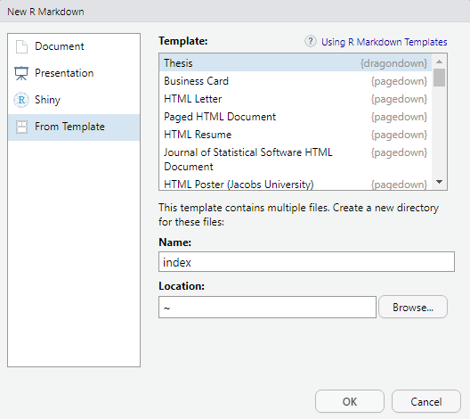

# `dragondown`

<center>

</center>

This project was inspired by the [`thesisdown`](https://github.com/ismayc/thesisdown) package 

Currently, the PDF version is fully-functional.  The gitbook, word, and epub versions are developmental, have no templates behind them, and are essentially calls to the appropriate functions in bookdown.

Under the hood, the Drexel University LaTeX template is used to ensure that documents conform precisely to submission standards. At the same time, composition and formatting can be done using lightweight [markdown](https://rmarkdown.rstudio.com/authoring_basics.html) syntax, and **R** code and its output can be seamlessly included using [rmarkdown](https://rmarkdown.rstudio.com).

The large majority of the `drexel-thesis` LaTeX document class was developed by [W. Trevor King](https://github.com/wking) and can be found [here](https://github.com/DrexelPhysics/drexel-thesis). The `drexel-thesis.cls` file in this repo was created by following the instructions in their repo. A few minor changes were made to the `.cls` file in order to conform with the needs of this package, but for the most part, it is the same as the one they provided. 

## Customizing `dragondown` to your institution

To see how to create your own custom version of `dragondown` and `thesisdown`, check out the [`thesisdown`](https://github.com/ismayc/thesisdown) repo. 


## Using `dragondown` from GitHub

Most of these instructions are from [Ben Marwick's](https://github.com/benmarwick) [`huskydown`](https://github.com/benmarwick/huskydown) package adaptation of `thesisdown`.

Using **dragondown** has some prerequisites which are described below. To compile PDF documents using **R**, you are going to need to have LaTeX installed. By far the easiest way to install LaTeX on any platform is with the [tinytex](https://yihui.name/tinytex/) R package:

```{r}
install.packages(c('tinytex', 'rmarkdown'))
tinytex::install_tinytex()
# after restarting RStudio, confirm that you have LaTeX with 
tinytex:::is_tinytex() 
```

You may need to install a few extra LaTeX packages on your first attempt to knit as well. 

To use **dragondown** from [RStudio](http://www.rstudio.com/products/rstudio/download/):

1) Ensure that you have already installed LaTeX and the fonts described above, and are using the latest version of [RStudio](http://www.rstudio.com/products/rstudio/download/). You can use `dragondown` without RStudio. For example, you can write the Rmd files in your favourite text editor (e.g. [Atom](https://atom.io/), [Notepad++](https://notepad-plus-plus.org/)). But RStudio is probably the easiest tool for writing both R code and text in your thesis. It also provides a nice way to build your thesis while editing. We'll proceed assuming that you have decided to use the RStudio workflow.

2) Install the **bookdown** and **dragondown** packages: 

```r
if (!require("remotes")) install.packages("remotes", repos = "http://cran.rstudio.org")
remotes::install_github("rstudio/bookdown")
remotes::install_github("tbradley1013/dragondown")
```

3) Use the **New R Markdown** dialog to select **Thesis**:

    

    Note that this will currently only **Knit** if you name the directory `index` as shown above. This guarantees that `index.html` is generated correctly for the Gitbook version of the thesis.

4) After choosing which type of output you'd like in the YAML at the top of index.Rmd, **Knit** the `index.Rmd` file to get the book in PDF or HTML formats.

### Day-to-day writing of your thesis 

You need to edit the individual chapter R Markdown files to write your thesis. It's recommended that you version control your thesis using GitHub if possible. RStudio can also easily sync up with GitHub to make the process easier. While writing, you should `git commit` your work frequently, after every major activity on your thesis. For example, every few paragraphs or section of text, and after major step of analysis development. You should `git push` at the end of each work session before you leave your computer or change task. For gentle novice-friendly guide to getting starting with using Git with R and RStudio, see <http://happygitwithr.com/>.

## Rendering

To render your thesis into a PDF, open `index.Rmd` in RStudio and then click the "knit" button. To change the output formats between PDF, gitbook and Word , look at the `output:` field in `index.Rmd` and comment-out the formats you don't want.

The PDF file of your thesis will be deposited in the `_book/` directory, by default.

## Components

The following components are ones you should edit to customize your thesis:

### `docs/approval-form.pdf`

In the original implementation of the drexel-thesis class, the approval form was developed with pure LaTeX. Unfortunately, since the class was written, the approval form has been updated, and since I am not a LaTeX expert, I did not recreate the new form in pure LaTeX. In this implementation, the `drexel-thesis` class just includes a pdf file named `docs/approval-form.pdf`. This package includes a blank form from the [Drexel Graduate Forms page](https://drexel.edu/graduatecollege/forms-policies/forms/). You can use the blank form in your output or you can either replace the default file or add a new file with the information filled in. If you add a new file, you can specify the location of the file with the YAML parameter `approvalform`:

```
approvalform: path/to/file
```

If you do not want to include the approval form in your thesis rendering, then you can simply open the `template.tex` file in your repo and remove the `approvalform` option from the `\documentclass` line. The `\documentclass` should now read something like this:

```
\documentclass[subfig,blackref]{drexel-thesis}
```

### `_bookdown.yml`

This is the main configuration file for your thesis. It determines what Rmd files are included in the output, and in what order. Arrange the order of your chapters in this file and ensure that the names match the names in your folders. 

### `index.Rmd`

This file contains all the meta information that goes at the beginning of your
document. You'll need to edit this to put your name on the first page, the title of your thesis, etc.

### `01-chap1.Rmd`, `02-chap2.Rmd`, etc.

These are the Rmd files for each chapter in your dissertation. Write your thesis in these. If you're writing in RStudio, you may find the [wordcount addin](https://github.com/benmarwick/wordcountaddin) useful for getting word counts and readability statistics in R Markdown documents.

### `bib/`

Store your bibliography (as bibtex files) here. We recommend using the [citr addin](https://github.com/crsh/citr) and [Zotero](https://www.zotero.org/) to efficiently manage and insert citations. 

### `csl/`

Specific style files for bibliographies should be stored here. A good source for
citation styles is https://github.com/citation-style-language/styles#readme

### `figure/` and `data/`

Store your figures and data here and reference them in your R Markdown files. See the [bookdown book](https://bookdown.org/yihui/bookdown/) for details on cross-referencing items using R Markdown.
